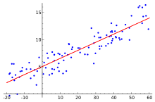
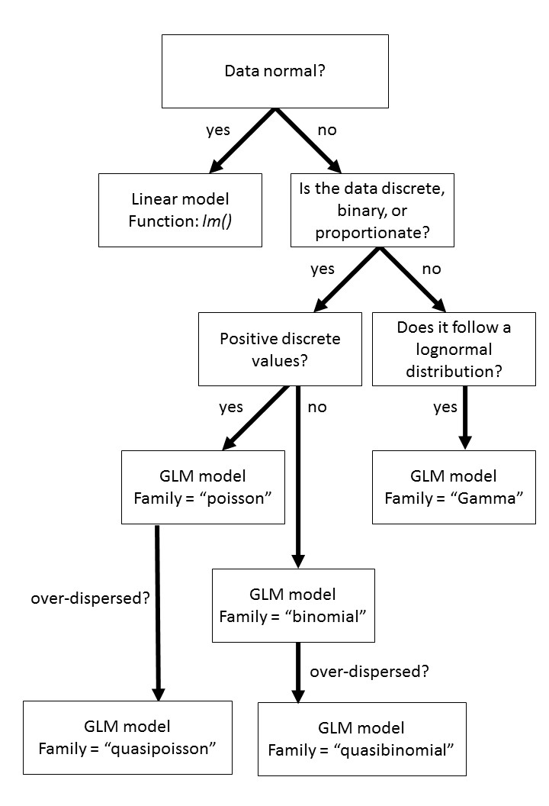
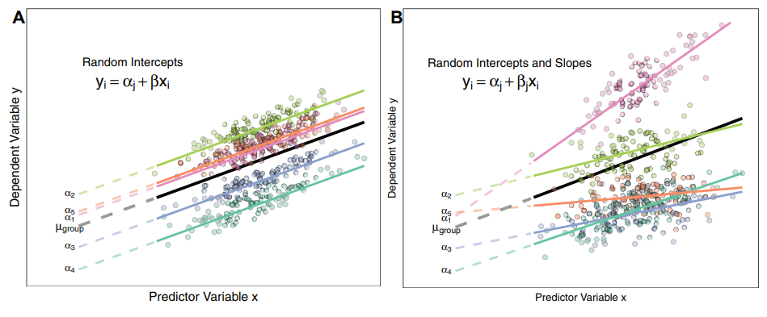

### Generalized Linear Models




[Presentation on GLMs](UnivariateAnalyses.pdf)

A univariate analysis is a statistical test that compares a response variable to a series of predictors. There are many different versions including linear regression, ANOVAs, ANCOVAs, and GLMs. We are going to briefly touch upon the math and then go into the differences between these models. 

First, let's touch upon the math behind linear regressions. The form for a linear regression is as follows:

`E [Y] = β X + ε`

This equation states that the expected value of a dependent variable (E[Y]) is determined by the value of a predictor variable (X) multiplied by a parameter coefficient (β) plus a residual (ε). In other words, your response is determined by your predictor multiplied by some value plus or minus some difference. 

Ex. Let's say that you are a jogger that runs every day and you want to determine the speed that you run at. You record the duration and distance that you run every day. Thus, the predictor is the duration of your run per day, the response is the distance that was run, and the parameter coefficient is the speed that you run at. The residuals in this model are represented by unexplained variation from this relationship, such as you having to stop to tie your shoe that would increase the length but not the distance. 

```{r warning=FALSE, message=FALSE}

duration <- c(30,60,45,44,36,58,57,22,25)
distance <- c(2.5,5.1,3.9,3.9,3,4.9,4.8,1.7,2.1)

plot(duration,distance)
```

To determine this parameter coefficient we run a linear model using the `~` tilda as the regressor. The formula is represented as such:

```{r}
m1 <- lm(distance~duration) ## linear model with response ~ predictor
summary(m1) ## see output of model
```

Here the parameter coefficient is under Estimate as 0.087 kilometres per minute or 5.22 kph. We also notice that the p value is extremely small and the R squared close to 1. These inform us that the model fits accurately. We can plot this relationship using the `abline` function. The distance between the line and each point is the residuals `ε`

```{r}
plot(duration,distance)
abline(m1, col="red") ## adds line from model
```

A Generalized Linear Model (GLM) is extremely similar to that of the LM in this regard. However, where the GLM differs is that it has an extra parameter called a "link function" (g^-1^). The link function determines how the mean of the response is related to the predictor. Thus, the GLM is represented as:

`E [Y] = (β X + ε) * g^-1`

Why use a GLM? There are three reasons why GLMs may be more appropriate:

* The response variable Yi is not normally distributed or the range is restricted (e.g. binomial, Poisson)
+ The variance of Y depends on the mean. 
+ GLMs can fit to particular distributions without transformations. The benefits of this include i) the homogeneity of variance does NOT need to be satisfied and ii) the response variable does not need to be changed. 

This last assumption has some associated complexities that could be read more on [here](http://stats.stackexchange.com/questions/67547/when-to-use-gamma-glms). However, as a rule, log transforming a response variable and then fitting it to a normal distribution is not the same as conducting a GLM with a log link. 

`E(log(Y)) ≠ log(E(Y))`

### Logistic regression - a form of GLM

To best understand how a GLM is executed, it is a good idea to go through an example. As said above, at the most basic, a GLM compares a response to one or more predictors. Let us consider a population of people that have a disease. Three drugs are being considered as potentially curing this disease. Eighty people are randomly divided into four groups, three for each drug treatment and one as a control. We would like to see if a drug was effective. 

This is an example of a logistic regression that is a member of the GLM family fit to a binomial distribution. The response variable here is not normal because the outcome of an individual can only be two values: 1 = cured or 0 = not cured. 

```{r}
drug.trial <- read.csv("data//drug.trial.csv")

##load data
head(drug.trial)

## drug.trial <- read.csv("https://raw.githubusercontent.com/afilazzola/UoALogisticRegression/main/data/drug.trial.csv")
```

The formula has the same syntax as the LM shown above. The response is followed by the tilda and the predictors. Here, we also specify where the data is coming from. In this case it is coming from the drug.trial data frame we created. Lastly, the main nuance of using the GLM function is the specification of a family. Since our data is binary and follows a binomial distribution, that is what we refer to it as. 
```{r}
m2<- glm(response~predictor, data=drug.trial, family="binomial") ##glm for drugs potential to curse

summary(m2) ##output of model
```

The output of the model reveals lots of information. The most important things to look at are the coefficients and the residual deviance. The GLM takes one of the predictor factors and treats it as a "dummy" variable. The result is that all the other factors are compared against that first value. These P-values therefore represent a comparison of each drug to the control which in itself is interesting, but not exactly what we are looking for. It is also important to examine the residual deviance and the residual degrees of freedom. As a general rule of thumb, the deviance should not be more than double the degrees of freedom, otherwise your data is overdispersed. You can read more here about [dummy variables](http://stats.stackexchange.com/questions/94010/understanding-dummy-manual-or-automated-variable-creation-in-glm) and [overdisperson](https://sada2013.sciencesconf.org/16139/document).

The summary results does not quite answer our question. We are interested if the drugs have an effect and if so, which drug is the best? To do this we need to conduct a significance test on the predictor to see if the effect is significantly different than zero. For binomial distributions this can be done with a chisq test. 

```{r}

anova(m2, test="Chisq") ## chisq test on predictor from model
```

Here we see that degrees freedom from the model (i.e. n-1), the residual deviance and DF again from the model output. The p-value here identifies that the effect is significant. R for some reason refers to the Chi-sq value from this test as "deviance". Judging by the high Chi-sq value, we can believe that the effect of this predictor is significant. We now must determine which drug treatment is most effective. 

Let's try another example with a continuous variable such as the effects of winter air temperature on lake ice

```{r}
## Create some data
iceData <- data.frame(icefree = c(0,0,0,0,1,0,1,1,1,1), temperature = c(-10,-7.5,-8.6,-5.2,-5,-2.3,0.5,0,1.1,3.7))

m3<- glm(icefree~temperature,  family="binomial", data=iceData) 
summary(m3)
anova(m3, test="Chisq")

library(ggplot2)
## Plot the logistic regression
ggplot(iceData, aes(x= temperature, y=icefree)) + geom_point() + geom_smooth(method="glm", method.args=list(family="binomial"), se=F)

## Plot your own range of values
m3Out <- data.frame(temperature = -10:4)
m3Out[,"icefree"] <- predict(m3, m3Out, type="response")

ggplot(m3Out, aes(x=temperature, y=icefree)) + geom_line() + geom_point(data=iceData, aes(x= temperature, y=icefree))

## Plot the log odds model
m3Out[,"logOdds"] <- predict(m3, m3Out, type="link")

ggplot(m3Out, aes(x=temperature, y=logOdds)) + geom_line() 


## Psuedo R2
m3null<- glm(icefree~1,  family="binomial", data=iceData) ##glm for drugs potential to curse
1-logLik(m3)/logLik(m3null) 

```

### Examine model sensitivity and specificity
```{r warning=FALSE, message=FALSE}
library(caret)
library(pROC)

## List actual vs predicted
actualData <- iceData$icefree
predictData <- predict( m3, iceData, type="response")

## set threshold
predictData <- ifelse(predictData > 0.5, 1, 0)

## Create confusion matrix
confusionMat <- table(actualData, predictData)
confusionMat

## Extract outputs
confusionMatrix(confusionMat)

## Create ROC graph
m3ROC <-  roc(icefree~temperature, data = iceData)
plot(m3ROC)

m3ROC ## get AUC
```

###  Different types of GLMs

There are many different types of GLMs that are possible in addition to the `binomial` family. Some of them involve changing the family in the glm function to the most appropriate data distribution. Other commons families include:

family          | type of data 
----------------|------------------------------
binomial        | binary (y = 0,1) or proportion (0<y<1).
poisson         | discrete count (y = 0, 1, 2, 3 ... i).
gamma           | continuous data that is right skewed, positive, and is on the log scale.
quasibinomial   | binary or proportion data that is overdispersed
quasipoisson    | discrete count data that is overdispersed. 

Quasibinomial and quasipoisson compensate for overdispersed data with an extra parameter `ϕ`. Theta here is a dispersion parameter that attempts to describe additional variance that cannot be explained by the distribution alone. As a general rule of thumb follow this workflow.




### Pairwise comparisons and packages

After conducting a GLM to identify differences, we often need to see which groups are different from each other. This is where pairwise comparisons come in to statistically test each group against each other. We will look at the `PlantGrowth` dataset already pre-loaded and the package `emmeans`.

```{r warning=FALSE, message=FALSE}
library(tidyverse)
ggplot(PlantGrowth, aes(group, y=weight)) + geom_boxplot(fill="Grey80") + ## plot data
  theme_classic() + xlab("") +  theme(text = element_text(size = 20))     ## aesthetics

m1 <- glm(weight ~ group, data=PlantGrowth)
anova(m1, test="Chisq")


```

The syntax for conducting a pairwise comparison is model, type of comparison (in this case pairwise), and lastly adjustment type. Tukey is a common technique that is also used for ANOVAs. 

```{r}
library(emmeans)
emmeans(m1, pairwise~group, adjust="tukey") ##conduct pairwise comparisons on predictor
```

The output of this function provides a lot of information including the model statistics for each of the groups. However, the most relative content now to our question is the p.value to determine which groups were different from one another and the estimate to see in what direction. Here, we can see that treatments 1 and 2 are different from each other. However, the other pairwise comparisons were not significant. This suggests treatment 2 increases plant growth compared to treatment 1, but not any different than control. The main difference effect we observed must therefore be because of the treatment 1 vs 2 comparison.

This completes a typical workflow when conducting a GLM. 
- Data exploration and selection of test
- Conduct model
- Model validation and checking of assumptions
- Prediction (if necessary)
- Pairwise comparisons (if necessary)


### Basics of mixed models



The paper by [Harrison et al. 2018](https://peerj.com/articles/4794/) does an excellent job introducing the core concepts of mixed models. An older MS by [Bolker et al. 2009](https://www.sciencedirect.com/science/article/pii/S0169534709000196) also does an great job explaining the elements of GLMMs including their execution in R.

We won't go too deep into details about GLMMs here since they are a complex topic, but we will introduce their concept to get most started. 

A generalized linear mixed model is a GLM that includes both fixed effects and random effects. All linear models have fixed effects, but not all have random effects. We use GLMMs whhen trying to test for a particular effect while controlling for another variable.

**Fixed effects:** predictor to test for significance; constant among observations; estimated using ML in GLMs
**Random effects:** predictor to account for variation among groups; estimates vary between observations; typically estimated based on a near-normal distribution

Examples:
- Testing the effect of a blood pressure drug on patients with different initial BP values
- Testing the effect of nutrient addition on plants surveyed in years with different growing conditions

To conduct mixed models in R there are many different packages and options. Some of the more popular options including `lme4`, `nlme`, and `glmmTMB`. Here we will explore the `lme4` option. 

*N.B.* When running a linear mixed model (not generalized) in `lme4` no p-values will be produced for [reasons](https://stat.ethz.ch/pipermail/r-sig-mixed-models/2008q2/000904.html) - tl;dr estimating denominator degrees freedom and reference distribution is as much of an art as a science. For an easy way out, consider using the `lmerTest` package instead of `lme4`. 

```{r warning=FALSE, message=FALSE}
library(lme4)

## Conduct mixed model
m1 <- glmer(hp ~ log(disp) + (1|cyl), data=mtcars, family="poisson")
## Test for differences
car::Anova(m1)


```
